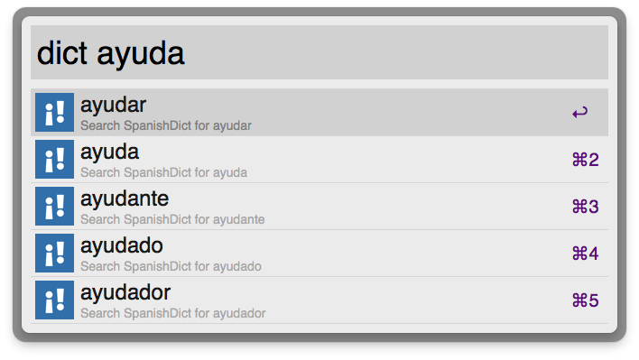

# SpanishDict Alfred Workflow

For anyone learning Spanish and finds they are constantly looking up conjugation tables. No real advanced features as yet.

[To install, click here](https://github.com/captainclam/spanishdict-alfred-workflow/raw/master/Spanish%20Dict.alfredworkflow)

# TODO

- Local json cache for quicker lookups of most common words. [Could easily re-use this](https://github.com/captainclam/spanish-conjugation-quiz/blob/master/client.coffee#L40-L51).

